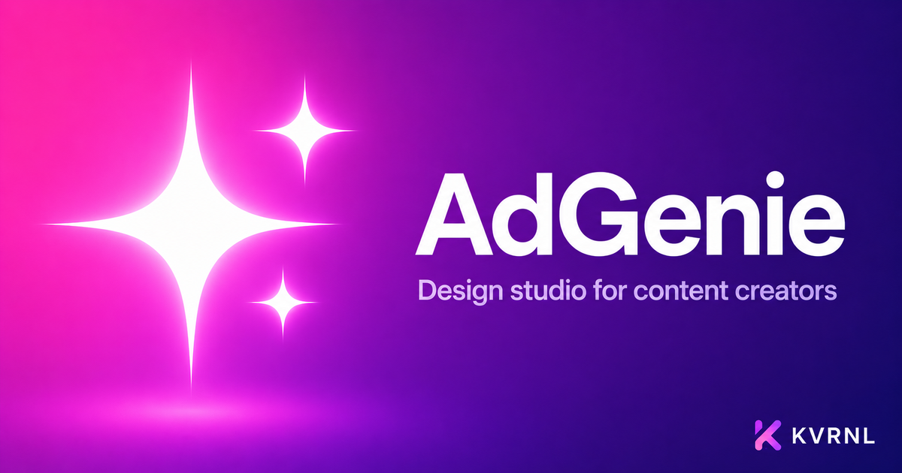

# AdGenie

### Design studio for content creators

 

Make scroll-stopping ads and social posts in minutes. Templates, layers, text, effects, one-click background removal, and a built-in AI designer — all on your desktop.

### **[⬇&nbsp; Download AdGenie — free at kvrnl.io](https://kvrnl.io/products/adgenie/)**

 

---

## What it does

AdGenie is a desktop design studio built for creators. Start from a template, drop in your photo, style your text, and add shapes and effects — then export to PNG, JPG, or PDF at any size, with presets for OnlyFans, Fansly, X, Bluesky and more.

Background removal runs entirely on your machine, so your photos never leave your computer. And the built-in AI designer builds your post live from a sentence — connect your Anthropic API key or Claude Code. Free to use; claim your license key and download it straight from this page.

## Features

- **Templates → drop in your photo → export**
- **Layers, text, shapes & effects (shadow, glow, stroke)**
- **On-device background removal — fully private**
- **Built-in AI designer that builds posts live**

## Download &amp; install

AdGenie is **completely free**. Each install needs its own license key, which you get
with a free KVRNL account.

1. Go to **[kvrnl.io/products/adgenie/](https://kvrnl.io/products/adgenie/)**
2. Create a free account — email verification, nothing else
3. Claim your license key — instant, no waiting
4. Download and install

> [!NOTE]
> AdGenie isn't code-signed yet, so Windows SmartScreen may warn you on first run.
> Click **More info → Run anyway**. Code signing is on the roadmap.

## Your license key

- **Free, one per product**, issued from your KVRNL account.
- **A key activates on one machine.** The first device to activate it claims it.
- **Switching computers?** Hit **Release device** on your
  [account page](https://kvrnl.io/account/) and the key is free to use again.
- Keys are checked over HTTPS at launch. See [Privacy](#privacy).

## Requirements

- **Windows 10 or 11** (64-bit)
- A free [KVRNL account](https://kvrnl.io/signup/) for your license key

## Privacy

AdGenie sends KVRNL only what's needed to validate your license: **the key, the
product name, and a hardware ID**. No telemetry, no analytics, no tracking, and
none of your files. Full policy: **[kvrnl.io/privacy](https://kvrnl.io/privacy/)**

## What's new

**v1.1.12** — 2026-09-25
  - New activation screen: clear steps for creating a free KVRNL account and getting your key, with buttons that open the right page for each step. Handy if you downloaded AdGenie from somewhere other than kvrnl.io.
  - Activating is easier: a Paste button, pasted keys are cleaned up automatically, and every problem comes with plain-English help and the right next step.
  - Stronger license protection: AdGenie stays fully locked until your key is confirmed, and your license details are now stored securely on your PC.
  - More reliable license checks: a hiccup on our license server no longer says your key is invalid, and startup shows "Checking your license" instead of seeming to do nothing. Offline, AdGenie keeps working for up to 14 days, then asks you to go online once.
  - Fixed: dragging a file onto the AdGenie window could replace your design and lose your work.

**v1.1.11** — 2026-09-06
  - Codex is here: choose Codex · ChatGPT as your AI engine and design with your ChatGPT account — no API key needed.
  - New Image output in AI Studio: ChatGPT generates a real picture for your post straight onto the canvas, ready to export.
  - Pick your AI engine, model and output right in the AI Studio header. Newest Claude models added: Sonnet 5, Opus 5 and Fable 5.1.
  - Export fixes: AI-mode size presets now scale instead of cropping, PDF from AI mode is a real PDF, and blur effects and the snap grid export correctly.
  - Stop now really stops Claude Code, long AI sessions no longer stall, and keyboard shortcuts stay out of text boxes and AI mode. Plus smaller fixes throughout.

**v1.1.10** — 2026-08-18
  - Downloads and automatic updates now come straight from KVRNL's own servers instead of a third-party host. Updates are quicker and more reliable, and nothing inside the app itself has changed.
  - If you installed this app before today, please download it once more from kvrnl.io. Older copies still look for updates at the old location and can't carry themselves across the move — this one time has to be done by hand.

**v1.1.9** — 2026-07-05
  - AI Studio can now build with the full webpage toolbox — callouts, notices, buttons, badges, cards, lists, tables, inline SVG icons, and embedded photos — all composed into your design.
  - Real, scannable QR codes: type a link in the new QR field and the AI drops a working QR into the design.
  - Everything the AI builds always fits inside the fixed canvas frame — never larger, never cut off.

**v1.1.7** — 2026-07-05
  - AI Studio now builds a complete, real HTML5 document so the preview renders exactly like a hand-built web page.
  - Moved the Capture button up to the top bar (out of the message area); it renders whatever's in the frame out to an image.

Full history → **[kvrnl.io/changelog/adgenie](https://kvrnl.io/changelog/adgenie/)**

## Documentation

Setup guides and how-tos → **[kvrnl.io/docs/adgenie](https://kvrnl.io/docs/adgenie/)**

## Support

> [!IMPORTANT]
> **We don't use GitHub Issues.** Report bugs from inside the app — it's the
> fastest route to us and it attaches the details we need automatically.

- 🐛 **Found a bug?** Use **Report a Problem** inside AdGenie
- 💬 **Chat with us** → **[Discord](https://discord.gg/Ub4SdAuhu)**
- ✉️ **Anything else** → **[kvrnl.io/contact](https://kvrnl.io/contact/)**
- ❓ **FAQ** → [kvrnl.io/faq](https://kvrnl.io/faq/)

## License

**Proprietary freeware — free to use, not open source.**

This repository hosts the installer releases, documentation, and license for
AdGenie. **The application source code is not published.** See
**[LICENSE](./LICENSE)** for the full terms.

---

 

**[kvrnl.io](https://kvrnl.io)** &nbsp;·&nbsp; **[All products](https://kvrnl.io/products/)** &nbsp;·&nbsp; **[Changelog](https://kvrnl.io/changelog/)** &nbsp;·&nbsp; **[Discord](https://discord.gg/Ub4SdAuhu)** &nbsp;·&nbsp; **[Contact](https://kvrnl.io/contact/)**

© 2026 <b>KVRNL</b> — an AI-powered software studio shipping free desktop tools.

